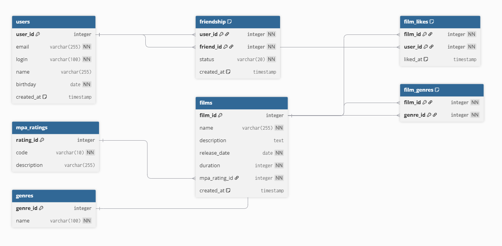

# java-filmorate
Template repository for Filmorate project.

# Filmorate - Database Design

## ER-диаграмма базы данных




## Описание структуры
База данных спроектирована в соответствии с **третьей нормальной формой (3NF)**.

### Основные таблицы
1. **`users`** — хранит информацию о пользователях.
2. **`films`** — хранит основную информацию о фильмах.
3. **`mpa_ratings`** — справочник возрастных рейтингов (G, PG, PG-13, R, NC-17).
4. **`genres`** — справочник жанров (Комедия, Драма, Боевик и т.д.).
5. **`film_genres`** — таблица-связка для реализации связи "Многие ко многим" между фильмами и жанрами.
6. **`film_likes`** — хранит лайки пользователей к фильмам.
7. **`friendship`** — хранит статус дружбы между пользователями (`PENDING` — запрос отправлен, `CONFIRMED` — дружба подтверждена).

### Нормализация
*   **1НФ**: Все атрибуты атомарны. Отсутствуют массивы значений в ячейках (жанры и лайки вынесены в отдельные таблицы связей).
*   **2НФ**: Неключевые атрибуты зависят от полного первичного ключа (например, в таблице `film_genres` нет других полей кроме составного ключа).
*   **3НФ**: Отсутствуют транзитивные зависимости. Название рейтинга MPA хранится в справочнике `mpa_ratings`, а не дублируется в таблице `films`.

## Примеры SQL-запросов

### 1. Получение фильма по ID (с жанрами и рейтингом)
```sql
SELECT f.film_id,
       f.name,
       f.description,
       f.release_date,
       f.duration,
       m.code AS mpa_rating,
       STRING_AGG(g.name, ', ') AS genres
FROM films f
JOIN mpa_ratings m ON f.mpa_rating_id = m.rating_id
LEFT JOIN film_genres fg ON f.film_id = fg.film_id
LEFT JOIN genres g ON fg.genre_id = g.genre_id
WHERE f.film_id = ?
GROUP BY f.film_id, m.code;
```

### 2. Топ-10 популярных фильмов
```sql
   SELECT f.film_id,
   f.name,
   COUNT(fl.user_id) AS like_count
   FROM films f
   LEFT JOIN film_likes fl ON f.film_id = fl.film_id
   GROUP BY f.film_id, f.name
   ORDER BY like_count DESC
   LIMIT 10;
   ```
### 3. Список общих друзей пользователя 1 и пользователя 2
```sql
   SELECT u.user_id, u.name, u.email
   FROM users u
   WHERE u.user_id IN (
   SELECT friend_id FROM friendship WHERE user_id = 1 AND status = 'CONFIRMED'
   UNION
   SELECT user_id FROM friendship WHERE friend_id = 1 AND status = 'CONFIRMED'
   )
   AND u.user_id IN (
   SELECT friend_id FROM friendship WHERE user_id = 2 AND status = 'CONFIRMED'
   UNION
   SELECT user_id FROM friendship WHERE friend_id = 2 AND status = 'CONFIRMED'
   );
```